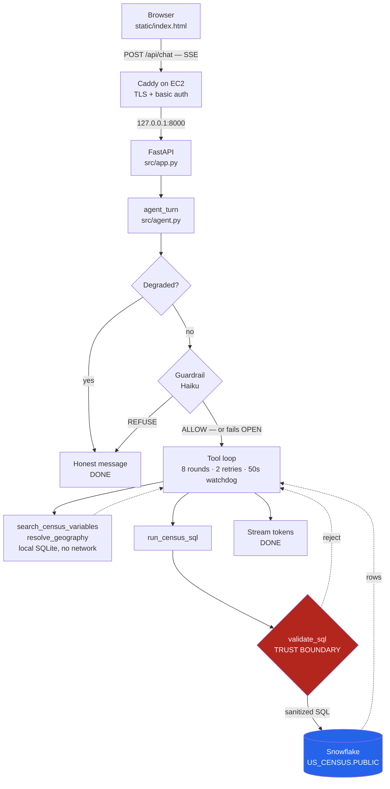

# censuschat

A chat agent that answers natural-language questions about US demographics,
grounded in the 2020 ACS 5-year estimates (SafeGraph's Open Census Data share
on the Snowflake Marketplace).

This README serves the two readers the assignment names: **a reviewer
evaluating the running demo** (start here) and **a new engineer learning the
architecture** (start at [Architecture](#architecture)).

---

## Evaluating the running demo

**URL:** https://censuschat.brianmar.com

| | |
|---|---|
| Username | `snowflake` |
| Password | `census` |

Health check, if you want to confirm the backend before opening the UI:

```bash
curl -u snowflake:census https://censuschat.brianmar.com/api/health
# {"status":"ok","snapshot":"ok","snowflake":"ok"}
```

`status` is `degraded` — never a crash — when the local snapshot is missing
or Snowflake is unreachable.

### Three probes, in order

Paste these into the Chat tab. Each one exercises a different required
behavior. Open the **Flow Diagram** tab after each to see the tool calls that
produced the answer.

These three are also listed at the top of the **Evals** tab, where clicking one
loads it into Chat. They are run by hand, so they appear in no recorded eval
run — but each duplicates a golden scenario (`DF-05`, `AMB-01`, `UN-01`), named
there so the two lists cannot drift apart.

**1. Happy path — grounded retrieval**

```
What is the total population of Wyoming?
```

Expect **581,348**. This is the real figure this share returns, confirmed by
direct query and asserted as a literal string in the eval suite (`DF-05`).
*Watch for:* tokens streaming rather than a blank wait, and a Flow Diagram
showing `resolve_geography` → `search_census_variables` → `run_census_sql`
with the actual SQL and returned row.

**2. Ambiguous — asks instead of guessing**

```
How many people live in Washington County?
```

Thirty states have a Washington County. *Watch for:* the agent listing
candidates and asking which one, rather than silently picking the largest or
the first. This is enforced twice — as a system-prompt instruction, and as a
code-level backstop that blocks `run_census_sql` outright if the model tries
to proceed on an unresolved ambiguity (**D-014**). The Flow Diagram shows the
blocked call when the backstop fires.

**3. Unanswerable — fast, honest refusal**

```
How many people will live in Texas in 2050?
```

The ACS is a measurement of the past, not a projection. *Watch for:* a quick
refusal that explains *why* the dataset cannot answer it, with **zero tool
calls** in the Flow Diagram — the assignment's "fast-fail" path. Note the
mechanism: this one passes the guardrail and is declined by the agent itself,
whereas an off-topic question ("What's the weather in San Francisco?") is
stopped earlier by the guardrail classifier.

Responses are streamed over SSE, so a tool-using query shows progress
throughout rather than blocking. A 50-second watchdog ends tool use and
returns an honest partial answer before the assignment's 60-second bound.

---

## Architecture

### Request lifecycle



Two tools never leave the box: `search_census_variables` and
`resolve_geography` read local SQLite snapshots built once at startup. At
request time, **Snowflake is touched by exactly one code path**,
`run_census_sql`.

### The trust boundary

The agent has three tools and one gate. The distinction that matters:

| Layer | Kind | What happens when it fails |
|---|---|---|
| System-prompt instructions | Soft | Model may ignore them |
| Guardrail classifier (Haiku) | Soft | **Fails OPEN** — allows the turn |
| `validate_sql` (`src/sqlgate.py`) | **Hard** | Query never reaches Snowflake |

The guardrail deliberately fails open. A classifier outage must not take the
product down, and a classifier is not what makes the system safe — so it is
built to be bypassable without consequence. Everything load-bearing lives
below it, in code:

- sqlglot parse with `dialect="snowflake"` — no regex, no string matching
- exactly one statement, and it must resolve to a `SELECT` (CTEs allowed)
- every referenced table in a 31-entry allowlist, compared on the fully
  qualified rendered name so `US_CENSUS.PUBLIC."2020_cbg_b01"` does *not*
  match `US_CENSUS.PUBLIC.2020_CBG_B01`
- banned constructs rejected: DML/DDL, `INTO`, session variables, procedure
  calls, and star projection — `SELECT *` on tables averaging ~280 columns
  widens the scan regardless of `LIMIT`, so columns must be named (**D-007**);
  `COUNT(*)` is the one exemption, since it reads no column data
- **zero table references is itself a rejection**, not a no-op. That is the
  shape every read-without-naming-a-table escape takes —
  `TABLE(RESULT_SCAN(...))`, `SYSTEM$` functions, `INFORMATION_SCHEMA`
  helpers. A census answer always reads a census table.
- a table position sqlglot cannot resolve to an identifier is unverifiable
  and therefore denied, rather than waved through
- `LIMIT` injected when absent; `STATEMENT_TIMEOUT_IN_SECONDS` set on the
  session

User text is never interpolated into SQL. An allowlisted `FROM` clause does
not launder the rest of a statement — the gate inspects every table node, not
just the first. `validate_sql` carries 175 of the suite's tests for this
reason.

The second hard rule is grounding: every numeric claim must come from rows
returned by that turn's query. Zero rows is an honest "not found," never a
number.

### Everything else

- **Session state** is full-history replay from SQLite keyed by `session_id`
  (`src/sessions.py`) — no summarization, no vector store. Multi-turn context
  survives a page reload.
- **Two independent bounds on the tool loop**, worth not conflating:
  `MAX_RECOVERY_RETRIES = 2` limits *retries after a failure* (a SQL error or
  zero rows → re-search or rewrite, then an honest failure explaining what was
  tried), while `_MAX_TOOL_LOOP_ITERATIONS = 8` caps *total rounds* even when
  every call succeeds. The second is what a genuinely multi-step question runs
  into — see the `PM-08` red row under [Testing and evals](#testing-and-evals).
  A 50-second watchdog bounds wall-clock independently of both.
- **Degraded mode**: Snowflake reachability is checked once at boot and
  cached (**D-015**), because rule 13 forbids the request path from probing
  Snowflake. A snapshot-missing or Snowflake-down boot still serves 200s.
- **No agent frameworks.** Anthropic SDK + FastAPI + sqlglot +
  snowflake-connector-python. Models pinned in one module
  (`src/model_config.py`): Sonnet for the agent, Haiku for the classifier.
- **Interface contract** is `src/contracts.py`, treated as frozen. Decisions
  and interpretation calls are logged in `docs/decisions.md` (D-001 … D-020).

### What each tab shows

The frontend is one static HTML file, vanilla JS, CDN-free, no build step.

| Tab | Shows |
|---|---|
| **Chat** | The agent itself. SSE token streaming, a tool-status line, session id persisted in `localStorage`. |
| **Evals** | Three sections, deliberately separated: the hand-run **demo probes** below (click one to load it into Chat), the **executed** rows from `evals/results/latest.json` with each scenario's question, provenance badge, checks and answer, and the **backlog** of authored-but-never-run scenarios behind a toggle. A row's badge says whether it was designed in the PRD before any code existed or authored afterward — the two are not equally strong evidence. |
| **Flow Diagram** | The current turn's real SSE events as a timeline: guardrail decision, each tool call with args and a bounded result digest, elapsed ms. This is the fastest way to see *why* an answer came out the way it did. |
| **Trace Logging** | Per-turn spans with latency and input/output token counts per model call. An in-process stand-in for Langfuse, not a replacement — see [What's cut](#whats-cut-and-why). |
| **Data Source** | A static description of the dataset: provenance, the CBG grain, the table allowlist, the 28-group topic taxonomy, variable naming, and the known data traps. |

---

## Documented interpretations

The assignment leaves several decisions open and asks that interpretations be
documented. Full reasoning in `docs/decisions.md`; the ones that change what
the agent can answer:

**2020 vintage only.** Both a 2019 and a 2020 vintage exist in the schema.
The allowlist admits only 2020 (**D-003**). Block groups were redrawn for the
2020 decennial and the 5-year windows overlap in 4 of 5 years, so
cross-vintage comparison is statistically invalid. Restricting the allowlist
makes the invalid query *impossible at the trust boundary* rather than merely
discouraged in a prompt. Cost accepted: "how did X change since 2019" can
only ever receive an explanation, never a number.

**State and county grain, with an explicit city redirect.** Every table in
this share is at census-block-group grain; there are no place, ZIP, or metro
boundaries. State and county roll-ups are computed by truncating the 12-char
`CENSUS_BLOCK_GROUP` key. For a city question the agent says so plainly and
offers the containing county as a substitute the user must confirm — never
silently equating "Austin" with the larger Travis County (**D-005**).

**Complete coverage of the estimate set, with two deliberate exclusions.**
The assignment's "Comprehensive Mapping" tip warns against limiting yourself
to a subset, and the search corpus is indeed complete *with respect to the
estimates a user can ask about*: all 3,782 estimate fields across 298 ACS
tables and 28 topic groups, plus the metadata and FIPS join tables the tip
specifically calls out. Two classes are excluded from **retrieval** (not from
the database) because indexing them makes answers worse:

- **Margin-of-error (`m`) fields.** Estimates and MOEs pair 1:1, share a
  numeric type, and carry near-identical labels. An indexed MOE row is a
  retrieval hit that *reads like the answer* — asking for "median household
  income" could return `B19013m1`, a confidence-interval half-width, rendered
  as a dollar figure. MOE remains fully reachable: the agent derives the `m`
  column from a resolved `e` column by suffix substitution. It simply cannot
  *search* its way to one (**D-008**).
- **`B99*` allocation tables.** These report how many responses were
  *imputed*, not the underlying demographic. In the FTS viability probe,
  "grandparents raising grandchildren" returned `B99102` "Allocation Of
  Grandparents Living With Grandchildren" as the top hit — an imputation-rate
  statistic masquerading as a demographic answer.

Both exclusions follow the same principle: a plausible-looking wrong variable
is worse than no hit. That principle is also why retrieval is FTS5 + BM25
rather than embeddings — a documented probe found the gap was
morphological, not semantic ("worked at home" vs. the Census's "Worked from
home"), which ranking fixes and embeddings would solve at higher cost. See
`docs/schema-notes.md` Appendix A.

Where the data genuinely lacks a variable — grandparents raising
grandchildren, unmarried-partner households — the correct answer is that this
dataset doesn't carry it, not a near-miss substitute.

---

## Running locally

```bash
python3 -m venv .venv && source .venv/bin/activate
pip install -r requirements.txt
cp .env.example .env      # fill in credentials
uvicorn src.app:app --reload
```

Open http://localhost:8000/. First boot builds the local variable/geography
snapshot from Snowflake (a few seconds); later boots reuse
`data/snapshot.sqlite3`. `scripts/check_env.py` verifies your environment
before you start.

`.env.example` documents every variable with no values (secrets never enter
the repo).

| Variable | Required | Notes |
|---|---|---|
| `SNOWFLAKE_ACCOUNT` | yes | |
| `SNOWFLAKE_USER` | yes | |
| `SNOWFLAKE_PRIVATE_KEY_PATH` | yes | Key-pair auth; the file itself is never committed. **Locally this is a host path; in the deployed container it is the mount target `/run/secrets/snowflake_key.pem`** — see the compose table below |
| `SNOWFLAKE_WAREHOUSE` | yes | |
| `SNOWFLAKE_ROLE` | yes | |
| `SNOWFLAKE_PRIVATE_KEY_PASSPHRASE` | no | Only if the key is encrypted |
| `SNOWFLAKE_DATABASE` | no | |
| `SNOWFLAKE_SCHEMA` | no | |
| `ANTHROPIC_API_KEY` | yes | Agent and guardrail |
| `SNAPSHOT_DB_PATH` | no | Defaults to `data/snapshot.sqlite3` |
| `SESSION_DB_PATH` | no | Defaults to `data/sessions.sqlite3` |
| `LANGFUSE_PUBLIC_KEY` / `LANGFUSE_SECRET_KEY` | no | Reserved; full Langfuse integration is cut (rule 17 is served by the in-app Trace Logging tab instead) |

Three further variables exist **only for `docker-compose.yml`** and are never
read by application code, so they won't appear if you go looking for them in
`src/`:

| Variable | Used by | Notes |
|---|---|---|
| `SNOWFLAKE_PRIVATE_KEY_HOST_PATH` | compose | Host path to the `.pem`, used as the bind-mount *source*. Distinct from `SNOWFLAKE_PRIVATE_KEY_PATH`, which is the path *inside* the container |
| `BASIC_AUTH_USER` | Caddy | |
| `BASIC_AUTH_HASH` | Caddy | bcrypt hash from `caddy hash-password --plaintext '<password>'`. Caddy never sees the plaintext |

If `SNOWFLAKE_PRIVATE_KEY_HOST_PATH` is unset, `docker compose` fails with
`invalid spec: :/run/secrets/snowflake_key.pem:ro: empty section between
colons` — an unhelpful message for a simple missing variable.

> Avoid `docker compose config` on a populated host: it inlines `env_file`,
> printing every secret in `.env` as plaintext.

---

## Testing and evals

**338 tests, `make test`.** TDD (failing test first) on every deterministic
layer: the SQL trust boundary (`validate_sql`, 175 tests), guardrail routing,
bounded-recovery counting, the ambiguity backstop, the wall-clock watchdog,
degraded-mode detection, FTS ranking, `normalize_value`, and the eval scorer
itself — a scorer bug silently invalidates every result, so it gets
production-grade treatment.

LLM *behavior* is deliberately not asserted in mocked unit tests. That is a
golden-eval concern, and the split is load-bearing: the single worst bug in
this project — every live query failing on Snowflake identifier casing —
passed the entire mocked suite and was only caught against the real database.

**`make eval`** runs the golden set against the real stack (real Anthropic,
real Snowflake, real guardrail) and writes an `EvalRun` to `evals/results/`.

- **14 scenarios executed**, 13 passing in the latest run (92.9%). The
  original 11 are a verbatim subset of the 30 designed in
  `docs/plans/02-prd.md` §7 — the PRD's own IDs, turns, and expectations,
  authored during scaffolding *before* any agent code existed, so they were
  not reverse-engineered from a working system.
- **25 scenarios authored but never executed** (`status="pending"`), covering
  injection beyond one shape, malformed input, NULL and top-coded values, and
  a worst-case latency comparison. They are a specification of intended
  behavior, not evidence of it, and are labeled as such in the UI and the
  data.

`pass_rate` is computed from executed rows *before* pending ones are appended,
so the number reads 11/11 rather than 11/36. An unrun backlog must not move a
real measurement in either direction — deflating a genuine 11/11 to 11/36
would be as misleading as hiding the backlog. A pending row serializes as
`passed: false` with no checks, which means *no evidence*, not *failed*; the
`status` field is what the UI renders on.

**The one red row is deliberate.** `PM-08` ("average household income in
Texas?") is kept and triaged rather than deleted to make the run look clean —
it exhausts the 8-round tool-loop cap while discovering a
numerator/denominator pair, and is honestly recorded as flaky (it produces a
grounded answer in roughly two runs of three). Raising the cap trades against
the 50-second watchdog, so it was left out of scope deliberately rather than
overlooked; the scenario's own `notes` field carries that reasoning.

A green run would not mean much on its own, which is why `evals/README.md`
also documents where the harness *under*-verifies: `PM-02`'s check asserts
only that the answer contains "median" and doesn't error, while the behavior
the PRD actually wants — explaining that medians can't be aggregated — is a
`judge_groundedness` question, and that check is unimplemented.

---

## Deploying

Single container on EC2 behind Caddy (TLS + basic auth). From that host, with
`.env` populated:

```bash
./deploy.sh   # git pull --ff-only && docker compose up -d --build app, waits for /api/health
```

**Caddy is native on that host, not containerized** — it also serves
`memory.brianmar.com`, so it can't be replaced by the bundled `caddy` service
without taking that site down. `deploy.sh` therefore starts only the `app`
service, and `docker-compose.override.yml` publishes it on `127.0.0.1:8000`,
which the host's existing Caddyfile already reverse-proxies to with
`flush_interval -1` for SSE. Binding to loopback rather than `0.0.0.0` means
the app is unreachable except through Caddy, so basic auth can't be bypassed
by hitting the port directly. This deviates from rule 18 and is recorded as
**D-016**.

Two things are deliberately absent from git and must exist on the host:
`.env`, and the Snowflake private key. The key must be readable by the
container's `appuser` (uid 999) — if it's owned by `ubuntu` with mode `600`
the app boots *degraded* with a `PermissionError` in `docker compose logs
app`, rather than crashing.

---

## What's cut, and why

Full account in `docs/reflection.md`. Short version: a working, tested,
deployed core loop took priority over the decennial-redistricting data source
(**D-004**), real Langfuse tracing, and the full 30-scenario suite with an LLM
judge — all real, all scoped and partly designed, none finished.

- `judge_groundedness` is unimplemented. No executed scenario carries it, and
  the scorer fails it loudly rather than skipping it, so it can never inflate
  a pass rate.
- The `conflicting` category has zero coverage — both scenarios need the
  decennial tables that were cut, so there is nothing to run them against.
- The Trace Logging tab renders real per-turn span data but is in-memory and
  in-process only — a stand-in for rule 17's Langfuse requirement, not a
  replacement for it.
